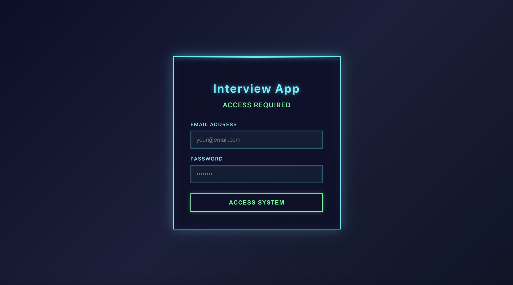
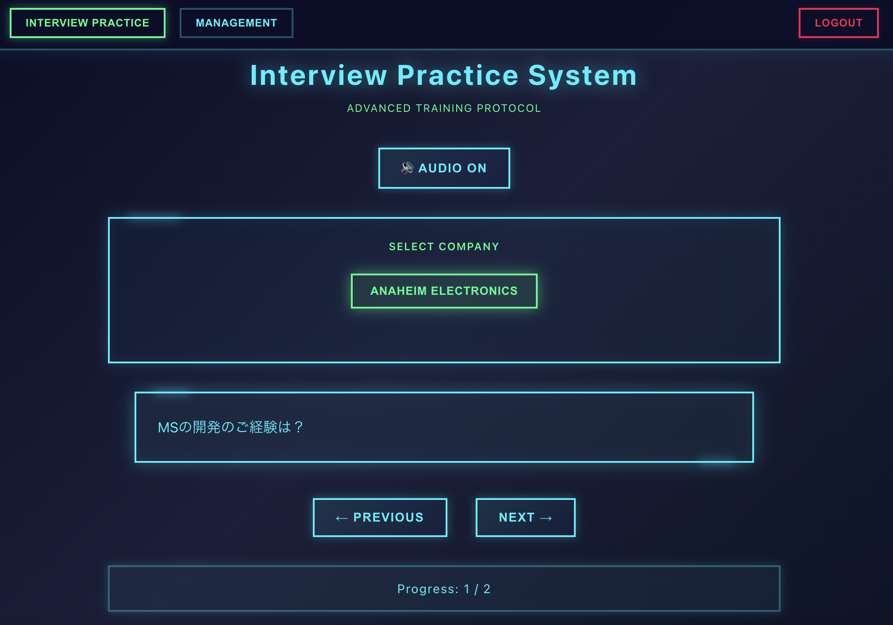
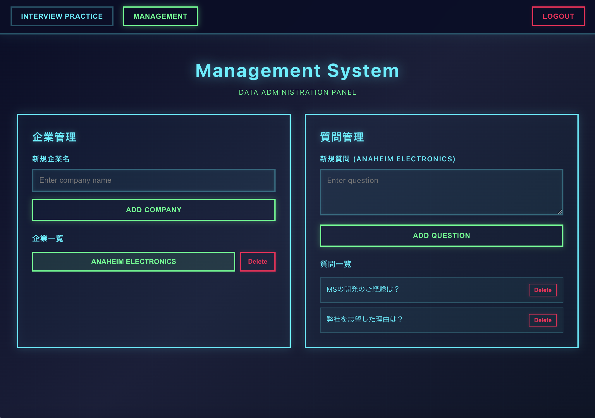

# Interview Practice System

本システムは、企業ごとの想定質問を登録し、模擬面接の練習を行うための **個人用 Interview Practice System** です。  
バックエンドをFirebaseで作成しています。(認証、データ管理等)

ログイン機能を備えており、**現在は作者の個人利用を前提としているため、新規ユーザー登録はできません(作者が個人的に使用しています。)**。

---

## 📁 画面イメージ

`photo/` ディレクトリに主要画面のスクリーンショットを配置しています。

### ● ログイン画面

### ● 面接質問画面

### ● 企業管理画面

---

## 🔐 特徴

### ■ ログインが必要（個人利用のみ）
- あらかじめ設定されたアカウントのみがログインできます。
- 現在は一般ユーザーが新規登録することはできません。

### ■ 企業ごとの想定質問を管理
- 任意の企業を登録可能
- 各企業に対して想定質問リストを作成
- 質問を確認しながら面接練習が可能

---

## 📦 起動
①**Firebase** にてAuthentification及びDatabaseの作成を行なってください。

②.envを用意し、Firebaseとの接続に必要な環境変数を設定してください。

③起動するとアクセスすることができます。(環境等はDockerfileを使用/参考にしてください。)
